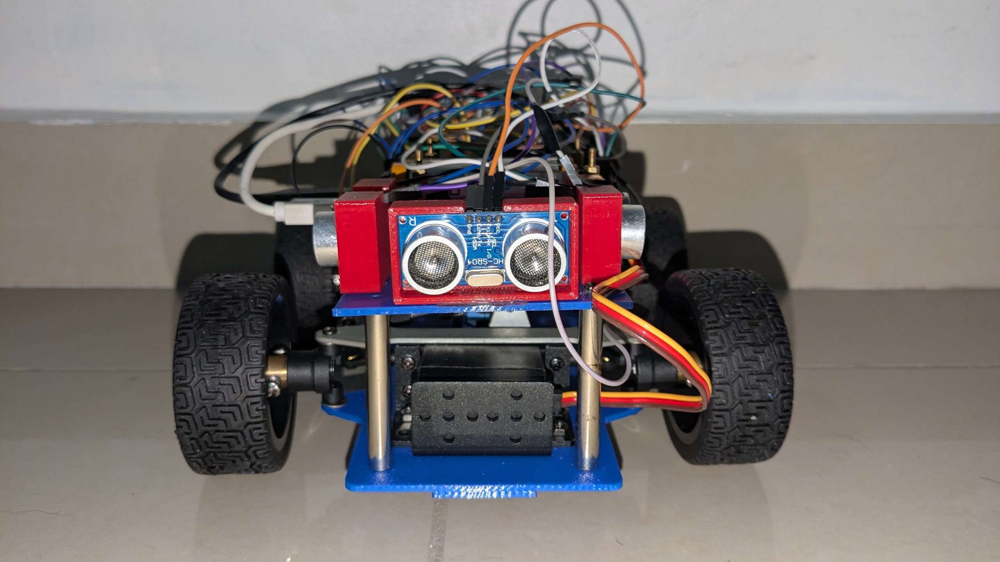

Encore | WRO-Futuros Ingenieros 2026 | PAN
====

Este es el repositorio oficial del equipo Encore V2. Somos representantes del colegio La Salle-Margarita en las regionales de Colón, Panamá de la World Robot Olympiad (WRO) 2026 en la categoría de Futuros Ingenieros.

La categoría de futuros ingenieros está enfocada en el diseño y la implementación de vehículos autónomos a escala. El desafío consiste en desarrollar un sistema capaz de navegar un circuito predefinido, identificando y superando obstáculos de forma autónoma mediante el procesamiento de datos de su entorno.

Esta disciplina está directamente alineada con las tendencias actuales y futuras de la industria automotriz, específicamente con el desarrollo de Sistemas Avanzados de Asistencia al Conductor (ADAS) y tecnologías de conducción autónoma. El proyecto de desarrollo exige una aplicación práctica de conceptos en áreas como la percepción ambiental, algoritmos de control y ingeniería de sistemas.

Nuestro proceso de desarrollo comenzó estratégicamente con un chasis prefabricado. Esta decisión nos permitió enfocarnos inicialmente en la integración de la electrónica y el desarrollo del software de control, sin la necesidad de conocimientos avanzados en diseño 3D. Sin embargo, pronto descubrimos que este punto de partida era solo el comienzo.

El verdadero desafío de ingeniería consistió en identificar sistemáticamente las limitaciones del diseño base y rediseñar cada subsistema para cumplir con nuestras exigentes expectativas de rendimiento. Desde la optimización del peso y la mecánica hasta la re-arquitectura completa del sistema eléctrico y de control, este robot es el resultado de un ciclo continuo de pruebas, diagnósticos y mejoras.

**Revise `docs` para ver la documentación completa y detallada, este `README.md` solo presenta un resumen de cada etapa del proyecto.**

## Equipo

Foto del equipo, de izquierda a derecha **José Heráldez, Abel Herrera y Pablo González**.

## Contenido del Repositorio

* `docs` Contiene todos los documentos del equipo y el diario de ingeniería.
* `other` Otros archivos relacionados al desarrollo del robot.
* `schemes` Contiene los esquemas electromecánicos del vehículo y otros diagramas.
* `src` Contiene todos los programas que se estarán usando en la competencia.
* `t-photos` Contiene 2 fotos grupales (una formal y una divertida) y las fotos individuales.
* `v-photos` Contiene las 6 fotos desde todos los ángulos.
* `video` Contiene el video de demostración del funcionamiento del robot.

## Generalidades del robot

### 1. Vista Lateral Derecha

*Vista del lado derecho del robot mostrando los componentes principales.*

### 2. Vista Frontal

*Vista frontal del robot con los sensores de distancia y configuración delantera.*

### 3. Vista Lateral Izquierda

*Vista del lado izquierdo del robot con los motores y estructura lateral.*

### 4. Vista Superior

*Vista desde arriba mostrando la distribución de componentes electrónicos y conexiones.*

### 5. Vista Trasera

*Vista desde atras mostrando la transmisión.*

### Configuración general

El desarrollo del robot partió de un chasis Ackerman prefabricado para establecer una base mecánica sólida y acelerar el prototipado. Sin embargo, este punto de partida se convirtió en el primer desafío de ingeniería, ya que el diseño original presentaba problemas significativos de peso y una configuración de propulsión y dirección que requería un rediseño completo para cumplir con los objetivos de rendimiento del equipo.

### Descripción del chasis

El chasis original de metal, aunque resistente, elevaba el peso total del robot a 1700 g, una masa excesiva que limitaba la agilidad y sobrecargaba el sistema de propulsión. Para resolver esto, se llevó a cabo un proceso de optimización de materiales, reemplazando las placas de metal por diseños impresos en 3D. Esta modificación fue un éxito, reduciendo el peso total a aproximadamente 675 g y permitiendo un diseño más limpio y optimizado con perforaciones específicas para nuestros componentes. La estructura se mantuvo en dos niveles para aislar la electrónica de las vibraciones mecánicas.

### Sistema de dirección

Para lograr una navegación precisa, se implementó una geometría de dirección Ackerman. Este sistema, que minimiza el deslizamiento de las ruedas en las curvas, fue un diseño a medida del equipo. A través de un proceso de investigación y prototipado, se fabricaron soportes y se calibraron las varillas de acoplamiento para emular la cinemática ideal. El sistema es accionado por un servomotor de alto torque, asegurando que la dirección sea firme y responda con precisión a los comandos.

### Sistema de propulsión

El diseño inicial del sistema de propulsión priorizaba la velocidad con una relación de engranajes de 9:7 (sobremarcha). Sin embargo, las pruebas demostraron que el torque resultante era insuficiente para vencer la inercia y la fricción estática, impidiendo que el robot se moviera por sí solo. Tras diagnosticar el problema, se tomó la decisión de ingeniería de invertir la relación a una de reducción 7:9. Aunque esto sacrificó la velocidad máxima, multiplicó el torque, proporcionando la fuerza de arranque necesaria para un funcionamiento autónomo y fiable.

### Diseño Eléctrico

La arquitectura eléctrica evolucionó a un sistema compacto y eficiente para maximizar la confiabilidad del robot.

* ESP32 (Unidad de control principal): Actualmente se utiliza una ESP32 única, sin Arduino adicional, como cerebro del sistema. Se encarga de ejecutar la lógica de control, leer los sensores y gestionar los actuadores.

* Driver TB6612FNG: Sustituyó al L298N y se utiliza para controlar de forma eficiente los motores, mejorando la gestión de corriente y la estabilidad del sistema.

* Sensores HC-SR04: Se emplearon tres sensores ultrasónicos en la parte frontal para detectar obstáculos y medir distancias en tiempo real.

* Giroscopio BNO055: Se incorporó para obtener mediciones de orientación y mejorar la estabilidad del movimiento y la navegación del robot.

* Servo para el manejo: Se utiliza para controlar la dirección del vehículo de forma precisa y responsiva.

### Gestión de la energía

La estabilidad energética se resolvió con un sistema de alimentación más simple y compacto:

* Un power bank de 10000mAh se utiliza para alimentar el motor y el servo.

* Dos baterías 18650 en conjunto proporcionan la energía necesaria para la ESP32, con salida de 5V para alimentar la unidad de control y sus periféricos. Esta configuración permite un funcionamiento estable y reduce la complejidad del sistema.

### Diseño del Código y Programación

La arquitectura del software se basa en un enfoque integrado en una sola placa de control:

* ESP32 (C++): Actúa como el cerebro principal del robot. Se encarga de la lectura de los sensores ultrasónicos, del giroscopio BNO055, de la lógica de decisión y del control de los actuadores, incluyendo los motores y el servo de dirección.

Este enfoque permite reducir la complejidad del sistema, minimizar puntos de fallo y mejorar la respuesta del robot en tiempo real.

### Demostración

Después de un arduo ciclo de desarrollo y pruebas, el robot es capaz de cumplir con los requisitos de la primera ronda, demostrando una navegación autónoma y la capacidad de detectar y esquivar obstáculos.

### Características por mejorar

Basado en los resultados de la primera competencia y las pruebas continuas, el equipo ha identificado las siguientes áreas clave para el desarrollo futuro:

* Reducir la Latencia del Bucle de Control: Optimizar el código y la comunicación interna entre la ESP32 y los actuadores para lograr reacciones más rápidas y una navegación más fluida.

* Mejorar la Fiabilidad de las Conexiones: Migrar las conexiones del protoboard a una solución más permanente, como una PCB diseñada a medida o una protoboard soldada, para eliminar los falsos contactos.

* Optimizar la Velocidad y el Control: Una vez que la fiabilidad esté garantizada, se trabajará en aumentar la velocidad máxima del robot y en refinar los algoritmos de control para una mayor precisión en el seguimiento de la trayectoria.
