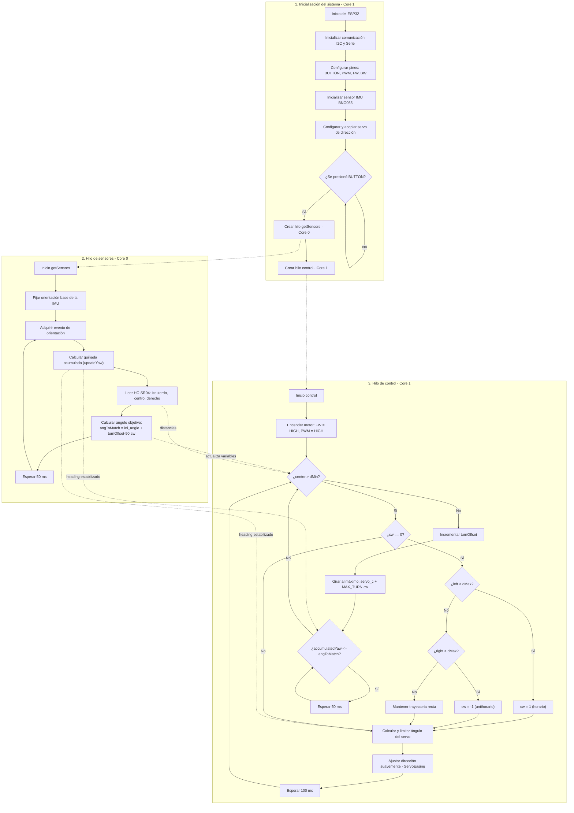

# DIARIO DE INGENIERÍA - EQUIPO ENCOREV2
## World Robot Olympiad (WRO) 2026 - Categoría Futuros Ingenieros (Vehículos Autónomos)

---

## 0. Datos generales del equipo

| Campo | Detalle |
|---|---|
| Nombre del equipo | EncoreV2 |
| País / Región | Panamá |
| Temporada | WRO 2026 |
| Categoría | Futuros Ingenieros (Carros Autónomos) |
| Entrenador | Octavio Herrera |
| Miembros | Abel Herrera - Programador / Desarrollo de software, algoritmia y CAD José Heráldez - Arquitecto de sistemas, diseño eléctrico, electrónica y documentación Pablo González - Diseño mecánico, impresión 3D y ensamblaje |

---

## 1. Resumen ejecutivo

El equipo EncoreV2 desarrolló su vehículo autónomo para la temporada WRO 2026 a partir de una revisión crítica del modelo 2025, cuyo chasis híbrido de acrílico cortado por caladora y piezas metálicas de kit comercial pesaba 1217 g y presentaba fricción excesiva en su tren de engranajes de Lego, lo que le impedía completar las tres vueltas reglamentarias dentro del límite de 2 minutos.

Para 2026 se rediseñó el robot bajo una filosofía de **simplificación inteligente y manufactura aditiva**: chasis monocasco impreso en 3D, tren de engranajes personalizado (36T:28T) también impreso, y consolidación del procesamiento en un único microcontrolador ESP32 de doble núcleo (eliminando el par Raspberry Pi + Arduino de la temporada anterior). El resultado es un vehículo de aproximadamente 675 g (–44.5 % de masa), que conserva el sistema de dirección Ackermann de la temporada anterior tras validar que su geometría seguía siendo óptima, permitiendo concentrar el tiempo de desarrollo en el nuevo tren motriz, la estructura y el software.

Este diario documenta no solo el diseño final, sino el **proceso**: los prototipos fallidos, las mediciones tomadas con pie de rey, los rediseños forzados por pruebas físicas, y el razonamiento detrás de cada decisión de componente.

---

## 2. Introducción, contexto y objetivos

### 2.1 Contexto del desafío WRO 2026
El desafío de Futuros Ingenieros exige un vehículo completamente autónomo que recorra una pista delimitada, evada obstáculos (pilares rojos y verdes que exigen rebase por la derecha e izquierda respectivamente) y realice un estacionamiento autónomo al final del recorrido. El robot está limitado a 300 mm × 200 mm × 300 mm y 1.5 kg.

### 2.2 Objetivos del proyecto
1. **Reducción de peso y fricción** - bajar de 1217 g a menos de 700 g mediante optimización topológica en CAD e impresión 3D.
2. **Minimización de latencia lógica** - consolidar el procesamiento en una sola MCU para una respuesta inmediata del servo ante los sensores.
3. **Optimización de consumo y estabilidad eléctrica** - aislar las líneas de potencia y lógica para evitar caídas de tensión ("voltage sags") que afecten al servo.
4. **Heredabilidad y validación de diseño** - reutilizar de forma justificada (no por comodidad) los subsistemas que ya funcionaban, para concentrar el tiempo de desarrollo en lo que realmente lo necesitaba.

### 2.3 Restricciones del proyecto (constraints)
- **Peso:** ≤ 1.5 kg (objetivo interno: <700 g).
- **Dimensiones:** 300 × 200 × 300 mm.
- **Tiempo por vuelta:** 3 vueltas dentro de una ventana de 2 minutos.
- **Tolerancia de manufactura:** los agujeros de tornillos impresos en 3D no admitían más de ±1 mm de error respecto a las medidas reales, tomadas con pie de rey.
- **Presupuesto:** los componentes se seleccionaron balanceando desempeño contra costo (p. ej. IMU de gama alta vs. sensores económicos con drift).
- **Tiempo del equipo:** al conservar la dirección heredada se liberó tiempo crítico para enfocarse en el tren motriz y el software.

---

## 3. CRITERIO 1 - Movilidad y diseño mecánico

### 3.1 Filosofía de chasis: de acrílico a monocasco impreso en 3D

El chasis 2025 era una base híbrida de acrílico cortado por láser combinada con piezas de un kit comercial tipo Ackermann metálico. El equipo evaluó dos rutas para 2026: **(a)** continuar modificando el chasis de acrílico, o **(b)** rediseñarlo por completo en impresión 3D.

## Encore Chassis

| 2025 | 2026 |
|---|---|
|  |  |
| Chasis híbrido de acrílico y metal | Chasis monocasco impreso en 3D |
| Mayor fricción en el tren de engranajes | Tren de engranajes personalizado y menor fricción |
| Peso total 1217 g | Peso total ≈675 g |
| Diseño basado en kit comercial | Diseño optimizado a medida |

Se optó por **(b)** por tres razones concretas, validadas durante el proceso:
- **Reducción de peso**, que a su vez reduce la fuerza que el motor necesita ejercer para impulsar el robot.
- **Mayor densidad de componentes**: al poder diseñar soportes a medida, se integraron más elementos electrónicos y mecánicos en menos espacio, haciendo al robot más compacto y ágil en curvas cerradas.
- **Iteración rápida**: un rediseño en CAD podía imprimirse como pieza funcional corregida en menos de 2 horas (caso del soporte del motor), algo imposible con corte láser + ensamblaje metálico.

### 3.2 Piezas impresas en 3D: proceso de diseño, prueba y rediseño

Todas las piezas fueron dimensionadas tomando medidas reales con **pie de rey** y trasladándolas al sistema CAD. Este fue, en palabras del propio equipo, uno de los procesos más exigentes del proyecto: el margen de error admisible en los agujeros de tornillo era de apenas 1 mm, ya que un error mayor impedía que el tornillo entrara.

#### 3.2.1 Placa inferior (base principal)
Base estructural impresa a partir de una placa de referencia previa. Sostiene el "primer piso" del robot: motor de tracción y servomotor de dirección.

#### 3.2.2 Placa superior
Sostiene los componentes electrónicos (el "segundo piso" del robot: ESP32, driver de motor, sensores).

#### 3.2.3 Soporte de llantas traseras - **iteración documentada**
- **Versión 1 (fallida):** los dos soportes del eje trasero se diseñaron como piezas **independientes**, sin conexión estructural entre sí.
- **Problema detectado en pruebas:** al usar las vigas en cruz de Lego como eje de propulsión, la falta de conexión estructural permitía que el eje se doblara bajo carga, generando fricción y rozamiento que desgastaba rápidamente la base.

- **Versión 2 (solución):** se unieron estructuralmente ambos soportes y se añadió un **punto de apoyo adicional en el punto medio del eje** (en vez de solo dos puntos de apoyo en los extremos, que concentraban la mayor flexión justo en el centro). Esto incrementó significativamente la rigidez del eje transversal y permitió que el motor ejerciera mayor fuerza sin que el eje se doblara.

#### 3.2.4 Base del motor - **la pieza que más iteración requirió**
Sin ninguna referencia previa de diseño (el motor no cuenta con tornillos propios para fijarse directamente), el equipo tuvo que idear un sistema de sujeción a partir de las pequeñas muescas del propio motor:
- Se diseñó una **pared con un orificio guía** para impedir que el motor se desplazara hacia adelante y el engranaje se saltara por encima del eje.
- Se le dio forma de "cama" con **cuñas laterales** para impedir el desplazamiento lateral.
- Se añadieron **3 tornillos en línea** para fijación directa a la placa inferior.
- Como refuerzo final, se incorporó un **tornillo pasante adicional que atraviesa la base del motor por encima del propio motor**, dándole una solidez muy superior a la esperada inicialmente y permitiendo ejercer mayor fuerza sin que el conjunto se desplace.

Para poder atornillar la base del motor sobre la zona ya reforzada de la placa inferior (ver sección 3.3, ensanchada a 4 mm), se utilizó la función de **barrido (sweep) para tornillos** del software CAD, generando una perforación cónica de 2 mm que deja el margen exacto para que el tornillo se asiente entre ambas piezas.

#### 3.2.5 Engranajes personalizados - **iteración documentada**
Se optó por imprimir los engranajes en 3D en lugar de comprarlos, por dos razones: **versatilidad** (réplicas rápidas y baratas) y **adaptación específica** a la forma peculiar del eje de salida del motor.
- El acople al eje del motor se midió con pie de rey y se modeló su geometría exacta (arcos incluidos).
- **Primer intento de impresión:** salió demasiado ajustado (pequeño) y no embonaba.
- **Segundo intento:** se aumentó ligeramente la tolerancia dimensional y el engranaje embonó perfectamente.
- El engranaje motriz (36 dientes) está basado en la geometría de un engranaje Lego de 36 dientes; el engranaje del eje (28 dientes) se diseñó con un enganche en cruz compatible con los ejes cruciformes de Lego.
- Al ser una **pieza de desgaste**, tener el archivo listo para imprimir permite reemplazo rápido y económico sin depender de piezas Lego originales, que son más costosas.

#### 3.2.6 Soportes de sensores ultrasónicos
Ver sección 4.3 (se documenta junto con la arquitectura de sensores, ya que la motivación es de confiabilidad de medición, no solo mecánica).

### 3.3 Refuerzo estructural de la placa inferior - **iteración por modo de falla**

**Problema detectado:** con un espesor uniforme de 2 mm (necesario para que los tornillos no sobresalieran), la placa inferior **flexaba** bajo peso y movimiento. Esto era peligroso porque, al pasar sobre un montículo o irregularidad de la pista, la placa podía rozar el piso y **atascar al robot**, dejándolo inmovilizado sin posibilidad de continuar la prueba.

**Solución:** se aplicó un **ensanche localizado de +2 mm** (para un total de 4 mm) únicamente en las zonas por donde pasan los tornillos estructurales importantes - **con la excepción explícita de la zona de tornillos de la base del motor**, donde el espesor debía mantenerse en 2 mm porque los tornillos disponibles (4 mm) no permitían atornillar correctamente sobre una base más gruesa (ver solución de barrido cónico en sección 3.2.4).

**Resultado:** la rigidez estructural aumentó considerablemente; ahora se requiere una fuerza significativamente mayor para deformar la placa, y la deformación residual es mínima. Este fue un ciclo completo de ingeniería: **problema detectado en pista → hipótesis → rediseño → prueba → validación**.

### 3.4 Sistema de dirección Ackermann - heredado y adaptado (no heredado por comodidad)

El mecanismo de dirección (servomotor de alto torque + bandeja metálica + varillas de transmisión ajustables, geometría Ackermann) se conservó del modelo 2025 tras un análisis explícito de costo-beneficio:

1. La geometría Ackermann del año anterior cumplía correctamente con el radio de giro mínimo exigido por las esquinas del circuito, sin inducir derrape en las llantas delanteras.
2. La bandeja metálica ofrecía una rigidez ante impactos de baja intensidad muy superior a lo que se podría lograr en una primera iteración impresa en 3D.
3. Rediseñar la dirección desde cero habría introducido variables mecánicas nuevas y consumido tiempo crítico que el equipo decidió invertir en el nuevo tren motriz y en el software.

**Iteración de integración necesaria:** al montar la dirección heredada sobre el nuevo chasis monocasco, las pruebas revelaron que el servomotor **golpeaba la base inferior** al girar en ciertos ángulos. La causa era la ausencia de espacio libre debajo del servo. **Solución:** se añadió una **ventana rectangular** en la placa inferior, exactamente en la zona de barrido del servo, eliminando la interferencia sin comprometer la resistencia estructural de la placa (gracias al ensanche de sección 3.3).

### 3.5 Tren motriz: relación de engranajes y análisis de par/velocidad

| Elemento | Valor |
|---|---|
| Engrane conductor (motor) | 36 dientes |
| Engrane conducido (eje trasero) | 28 dientes |
| Relación de transmisión (i) | 36/28 ≈ 1.285:1 (sobremarcha / *overdrive*) |

**Razonamiento de par vs. velocidad (trade-off explícito):**
El equipo probó ambas configuraciones:
- **Relación inversa (reducción, mayor par):** el robot se movía con mucha más fuerza disponible, pero a una velocidad insuficiente para completar las tres vueltas dentro del límite de 2 minutos.
- **Relación de sobremarcha 36:28 (mayor velocidad):** al ser el robot ya muy ligero (≈675 g), no se requiere una reducción de torque alta para vencer la inercia inicial. El motor trabaja holgado y desarrolla una velocidad lineal alta y constante.

**Decisión:** se sacrificó fuerza disponible por velocidad, aceptando que el motor debe trabajar más exigido, a cambio de cumplir la ventana de tiempo de la prueba. Esta es una compensación de diseño consciente, no una elección por defecto.

### 3.6 Tabla de compensaciones de diseño (trade-offs mecánicos)

| Decisión | Se ganó | Se sacrificó |
|---|---|---|
| Chasis monocasco 3D vs. acrílico + kit metálico | Menor peso, mayor densidad de componentes, iteración en <2h | Menor resistencia a impactos directos que el metal |
| Relación de engranajes 36:28 (overdrive) | Velocidad suficiente para cumplir el límite de 2 min | Mayor demanda de fuerza al motor |
| Soporte de eje conectado + apoyo central | Mayor rigidez, menor desgaste | Mayor complejidad de impresión que la versión independiente |
| Ensanche estructural de +2 mm | Rigidez, robot no se atasca en pendientes | Peso adicional localizado |
| Dirección heredada (no rediseñada) | Tiempo de desarrollo liberado para tren motriz y software | Integración física no trivial (interferencia con placa, resuelta en sección 3.4) |

---

## 4. CRITERIO 2 - Arquitectura de potencia y sensores

### 4.1 Selección de componentes: comparativas y justificación

#### Microcontrolador: ESP32 WROOM 32D
Se comparó explícitamente contra dos alternativas antes de decidir:

| Opción | Por qué se descartó / eligió |
|---|---|
| Arduino (descartado) | Memoria reducida, un solo núcleo (no permite paralelizar sensores y control), menor velocidad de procesamiento, menos pines disponibles, menor versatilidad general. |
| Raspberry Pi (descartada) | Consumo eléctrico elevado para la autonomía requerida; capacidades de cómputo muy superiores a lo necesario (sobre-ingeniería); no es un microcontrolador de tiempo real, por lo que habría requerido un esquema maestro-esclavo adicional (el problema exacto que se buscaba eliminar de la arquitectura 2025). |
| **ESP32 (elegido)** | Doble núcleo real: permite ejecutar la lectura de sensores y el control del servo/motor como **dos hilos simultáneos independientes**, mejorando la velocidad de toma de decisiones - algo crítico para esta categoría. |

Con el firmware actual, el ESP32 utiliza únicamente **~11 % de su memoria disponible**, dejando margen amplio para lógica adicional (redundancia, mayor velocidad de procesamiento) sin necesidad de cambiar de MCU.

#### Sensor de orientación: IMU Adafruit BNO055 (9 GDL)
El equipo evaluó sensores giroscópicos más económicos antes de decidirse por el BNO055 (~US$40):
- Los sensores económicos presentaban **drift** (deriva del error acumulado) y lecturas poco precisas.
- El BNO055 incluye un **procesador de fusión de sensores integrado**, entrega una orientación absoluta, con precisión de decimales de grado, y **sin drift perceptible**.
- Beneficio secundario no obvio: al no requerir cálculo de compensación de deriva, se **libera carga de procesamiento del ESP32**, que de otro modo tendría que ejecutar ese cálculo en cada ciclo.

**Trade-off aceptado:** mayor costo del componente a cambio de eliminar una fuente completa de error sistemático y de reducir la carga computacional del microcontrolador.

#### Sensores de distancia: 3× HC-SR04 (ultrasónicos)
Distribuidos en **abanico** (izquierdo, centro, derecho). Esta disposición fue elegida porque cubre exactamente las zonas de decisión necesarias: detección de pared frontal (parada de emergencia / inicio de giro) y detección de apertura de carril a izquierda o derecha (definición del sentido de giro).

#### Servomotor de dirección
Alto torque, acoplado directamente a la varilla metálica de dirección heredada. Se priorizó el torque y la velocidad de respuesta porque el algoritmo de navegación depende de que el giro máximo se ejecute de inmediato al detectar el borde del carril (ver sección 5.3).

#### Motor de tracción DC
Se eligió un micro-motor DC estándar por ser la opción más económica y de instalación más simple del catálogo evaluado (solo requiere dos cables de alimentación, sin protocolo de control adicional).

#### Controlador de motor: TB6612FNG vs. L298N
Se comparó explícitamente contra el controlador L298N (más común y económico):

| Controlador | Evaluación |
|---|---|
| L298N | Funcional, pero basado en transistores BJT que generan una **caída de tensión interna significativa**, reduciendo el voltaje real entregado al motor y, por tanto, el torque/velocidad máximos disponibles. |
| **TB6612FNG (elegido)** | Basado en MOSFET, con una caída de tensión interna mucho menor, entregando al motor una fracción mayor del voltaje nominal de la batería. |

**Decisión:** se eligió el TB6612FNG porque el objetivo de velocidad del tren motriz (sección 3.5) depende directamente de entregarle al motor el máximo voltaje disponible; el L298N habría anulado parcialmente la ganancia de velocidad obtenida con la relación de engranajes overdrive.

### 4.2 Distribución eléctrica y aislamiento de ruido

En la temporada 2025, la integración conjunta de Raspberry Pi y Arduino sufría caídas de tensión inesperadas por el consumo simultáneo del motor de tracción y el servomotor en el mismo bus eléctrico. Para 2026 se diseñó una distribución con **dos rieles físicamente separados**:

1. **Riel de potencia (línea ruidosa):** 7.4 V nominales (2× Li-Ion 18650 en serie) directo al driver TB6612FNG (VM) y al servomotor. Estos elementos de alto consumo e inducción magnética quedan aislados de la parte lógica.
2. **Riel lógico (línea limpia de 5 V):** mediante un regulador de tensión de alta eficiencia, alimenta al ESP32, los tres sensores ultrasónicos y la IMU BNO055.
3. **Punto común de tierra:** el GND de potencia y el GND de lógica se unen en un único nodo central, evitando bucles de tierra ("ground loops") que corromperían las señales digitales del ESP32.

**Modo de falla detectado y corregido durante pruebas:** con el circuito armado en protoboard sin esta separación, el servomotor presentaba **temblores erráticos** cada vez que el motor DC arrancaba (ruido inductivo acoplado a la línea lógica). Se resolvió aplicando la separación estricta de líneas descrita arriba.

*(Diagrama de cableado: ver imagen incluida en la sección 8 / repositorio GitHub.)*

### 4.3 Montaje de sensores ultrasónicos - **iteración por confiabilidad**

- **Versión inicial:** los sensores ultrasónicos se fijaban con cinta adhesiva directamente sobre la base.
- **Problema:** esta fijación no era permanente, dificultaba mantener el ángulo exacto necesario para cada sensor, y se desplazaba con el uso.
- **Solución:** se diseñaron **soportes impresos en 3D de ajuste a presión**, específicos para el HC-SR04, que fijan el sensor en un ángulo constante y permiten conexión/desconexión rápida sin perder la calibración angular.
- **Resultado:** eliminación del problema de desplazamiento; las mediciones ahora presentan buena estabilidad repetida.

### 4.4 Alimentación y autonomía

- 2× celdas Li-Ion 18650 en serie (2S, 7.4 V nominales): se eligieron por su buena relación voltaje/potencia/capacidad de carga para aplicaciones de robótica.
- Un par de baterías sostiene entre 1 y 2 horas de pruebas continuas.
- El equipo mantiene **dos pares adicionales de celdas 18650 de respaldo** para no interrumpir sesiones de prueba largas.

---

## 5. CRITERIO 3 - Arquitectura de software y estrategia de obstáculos

### 5.1 Consolidación de procesamiento multihilo en ESP32

Se eliminó la comunicación serie (UART) entre Raspberry Pi y Arduino Nano de la arquitectura 2025. El firmware corre nativamente en un solo ESP32 sobre **FreeRTOS**, dividiendo la carga en dos hilos que corren en núcleos separados:

- **Core 0 - Hilo de sensores (`getSensors`):** se ejecuta cada 50 ms (20 Hz). Lee secuencialmente los tres sensores ultrasónicos (izquierdo, centro, derecho) y adquiere de forma continua la orientación de la IMU BNO055.
- **Core 1 - Hilo de control (`control`):** corre con prioridad máxima. Evalúa las variables globales actualizadas por el hilo de sensores y ajusta la posición del servomotor (librería `ServoEasing`) y la dirección del motor de tracción vía el driver TB6612FNG.

Esta separación en dos núcleos fue la motivación central para elegir el ESP32 sobre Arduino (núcleo único) en primer lugar - ver sección 4.1.

### 5.2 Diagrama de flujo del sistema

### 5.3 Algoritmo de navegación y evasión

1. **Detección de curva/intersección:** el robot avanza en línea recta mientras los sensores laterales (`left`, `right`) miden distancias cortas y estables a las paredes interiores. Cuando un sensor lateral detecta un aumento súbito de distancia (por encima del umbral `dMax`, calibrado en 150 cm), se interpreta que el carril se abrió hacia ese lado.
2. **Definición del sentido de giro (`cw`):** `left > dMax` → sentido horario (`cw = 1`); `right > dMax` → sentido antihorario (`cw = -1`).
3. **Seguimiento de guiñada (yaw) sin discontinuidad:** la IMU entrega orientación absoluta 0°–359°. Para evitar el salto brusco al cruzar de 359° a 0° (que generaba virajes erráticos del servo), se implementó `updateYaw()`, que acumula el delta angular corrigiendo el cruce de frontera:
   - `Δ = ángulo_actual − ángulo_anterior`
   - si `Δ < -180°` → `Δ += 360°`; si `Δ > 180°` → `Δ -= 360°`
   - `ángulo_acumulado += Δ`
4. **Acción del servo:** el ángulo se ajusta de forma suavizada con `ServoEasing` hacia el objetivo, limitado a ±40° respecto al centro, para evitar picos de torsión que dañen el chasis impreso.
5. **Limitador de seguridad (sensor central):** si `center < dMin` (calibrado en 20 cm, ajustado a 40 cm tras pruebas), el software interrumpe la trayectoria recta e inicia el giro máximo inmediato en la dirección determinada, previniendo colisión frontal.

### 5.4 Pruebas y ajuste (tuning)

Durante el desarrollo se identificaron y corrigieron tres problemas mediante prueba física en pista (detalle completo en sección 7.5 - Historial de iteraciones):
- Calibración inicial de `dMax` generaba giros anticipados antes de llegar a las esquinas reales; se recopiló telemetría por WiFi (solo en fase de depuración, deshabilitada en competencia) y se reajustó el umbral hasta que el robot solo activara la lógica de curva al salir por completo de la zona de muros rectos.
- El umbral `dMin` se ajustó de 20 cm a 40 cm tras observar en pista que 20 cm dejaba muy poco margen de reacción.

---

## 6. CRITERIO 4 - Pensamiento sistémico y decisiones de ingeniería

### 6.1 Restricciones explícitas del proyecto
Peso máximo (1.5 kg, meta interna <700 g) · dimensiones (300×200×300 mm) · ventana de tiempo (2 min / 3 vueltas) · tolerancia de manufactura 3D (±1 mm en agujeros de tornillo) · espesor máximo de placa compatible con tornillería disponible (2 mm, salvo zonas reforzadas) · presupuesto de componentes (p. ej. IMU de alto costo justificado, motor DC económico sin justificación adicional necesaria) · tiempo de desarrollo del equipo (dirección no rediseñada para liberar horas hacia tren motriz y software).

### 6.2 Interacción entre subsistemas

El sistema se piensa como cuatro subsistemas interdependientes:

- **Mecánico** (chasis, tren motriz, dirección) define la masa e inercia que el subsistema de **potencia** debe mover, y el espacio físico disponible para el subsistema **electrónico**.
- **Potencia/electrónica** (baterías, driver, riles aislados) determina cuánta fuerza y estabilidad de señal recibe el subsistema **mecánico** (motor, servo) y el **software**.
- **Sensores** (ultrasónicos + IMU) alimentan directamente al **software** de navegación, y su ubicación física depende de decisiones tomadas en el subsistema mecánico (espacio en la placa inferior, soportes impresos).
- **Software** cierra el ciclo, traduciendo lecturas de sensores en comandos hacia motor y servo, cuya respuesta física depende, de nuevo, del diseño mecánico (rigidez, ausencia de flexión) y eléctrico (sin ruido, sin caídas de tensión).

Ejemplo concreto de esta interdependencia documentado en este diario: el ensanche estructural de la placa inferior (mecánico, sección 3.3) tuvo que dejar una excepción explícita en la zona de tornillos de la base del motor porque la tornillería disponible (eléctrico/mecánico) no lo permitía - una restricción de un subsistema condicionando la solución de otro.

### 6.3 Decisiones de ingeniería

| # | Decisión | Razonamiento |
|---|---|---|
| 1 | ESP32 en lugar de Arduino + Raspberry Pi | Se necesitaba paralelismo real (dos hilos) sin el consumo eléctrico ni la complejidad de una Raspberry Pi, ni las limitaciones de memoria/velocidad/núcleo único de un Arduino. |
| 2 | IMU BNO055 en lugar de un giroscopio económico | El drift de los sensores baratos introducía error acumulado inaceptable para el seguimiento de guiñada; el costo adicional (~US$40) se justifica por eliminarlo por completo y liberar cómputo del ESP32. |
| 3 | Driver TB6612FNG en lugar de L298N | El L298N reduce el voltaje entregado al motor por caída interna en sus transistores; el objetivo de velocidad (relación overdrive) exigía entregar el máximo voltaje posible. |
| 4 | Relación de engranajes overdrive (36:28) en lugar de reducción | Se priorizó cumplir la ventana de tiempo de 2 minutos sobre maximizar el torque disponible. |
| 5 | Chasis monocasco 3D en lugar de acrílico + kit metálico | Se priorizó reducción de peso e iteración rápida sobre la resistencia a impacto directo que ofrecía el metal. |
| 6 | Conservar la dirección Ackermann heredada en lugar de rediseñarla | Ya cumplía el radio de giro requerido y ofrecía rigidez estructural probada; rediseñarla habría consumido tiempo crítico sin beneficio claro. |
| 7 | Soportes de sensores ultrasónicos impresos a presión en lugar de cinta adhesiva | Se priorizó estabilidad y repetibilidad de la medición sobre la simplicidad de montaje inicial. |

### 6.4 Modos de falla identificados y mitigación

| Modo de falla | Causa raíz | Mitigación aplicada |
|---|---|---|
| Desgaste acelerado de engranajes PLA | Fricción térmica contra el eje de latón del motor | Lubricante de alta viscosidad + rediseño de tolerancia/módulo de diente en CAD |
| Flexión del eje trasero | Soportes de llanta independientes, sin conexión estructural | Conexión estructural entre soportes + apoyo central en el eje |
| Flexión de la placa inferior en pendientes (riesgo de robot atascado) | Espesor uniforme de 2 mm insuficiente | Ensanche localizado a 4 mm en zonas críticas |
| Servomotor golpeando la base inferior al girar | Ausencia de espacio libre bajo el servo en el chasis monocasco | Ventana rectangular en la placa inferior |
| Motor desplazándose y engranaje saltando el eje | Motor sin tornillería propia de fijación | Pared con orificio guía + cuñas laterales + 3 tornillos en línea + Zip Tie pasante |
| Temblor errático del servo al arrancar el motor | Ruido inductivo acoplado entre línea de potencia y línea lógica | Separación física de rieles + nodo de tierra común |
| Mediciones ultrasónicas inestables | Fijación con cinta adhesiva, ángulo no constante | Soportes impresos de ajuste a presión |
| Drift en orientación | Sensores giroscópicos económicos | Selección de IMU BNO055 con fusión de sensores integrada |
| Giros anticipados antes de la esquina real | Umbral `dMax` mal calibrado | Recolección de telemetría WiFi (solo depuración) + reajuste del umbral |
| Viraje errático al cruzar 359°→0° | Discontinuidad matemática del ángulo absoluto | Función `updateYaw()` con acumulación corregida |

### 6.5 Historial de iteraciones (ciclo planear → construir → probar → mejorar)

1. **Iteración 1 - Desgaste de engranajes:** prototipos en PLA fallan por fricción térmica → lubricante + rediseño de tolerancia.
2. **Iteración 2 - Latencia/ruido eléctrico:** temblor del servo al arrancar el motor → separación estricta de líneas lógicas y de potencia en la protoboard.
3. **Iteración 3 - Calibración de sensores de distancia:** `dMax` provocaba giros anticipados → telemetría WiFi de depuración + reajuste del rango dinámico.
4. **Iteración 4 - Soporte de llantas traseras:** de independiente (con flexión) a conectado con apoyo central.
5. **Iteración 5 - Base del motor:** de un primer diseño insuficiente a un sistema de pared + cuñas + tornillo pasante.
6. **Iteración 6 - Engranaje motriz:** primer intento de impresión demasiado ajustado → segundo intento con tolerancia aumentada.
7. **Iteración 7 - Rigidez de la placa inferior:** flexión detectada en pista → ensanche localizado de +2 mm.
8. **Iteración 8 - Montaje de sensores ultrasónicos:** de cinta adhesiva a soporte impreso a presión.
9. **Iteración 9 - Integración de la dirección heredada:** interferencia servo-chasis detectada en pista → ventana rectangular en la placa inferior.

---

## 7. Cumplimiento del reglamento WRO 2026

1. **Dimensiones y peso:** el robot cumple 300×200×300 mm y, con ≈675 g, se mantiene muy por debajo del límite de 1.5 kg.
2. **Propulsión de eje único:** tracción trasera por caja de engranajes acoplada mecánicamente + dirección Ackermann de un eje, sin tracción diferencial.
3. **Desactivación de conectividad inalámbrica:** el ESP32 cuenta con radio WiFi, usada exclusivamente en laboratorio para telemetría de calibración (sección 5.4/sección 6.5). El firmware de competencia incluye la directiva `WiFi.mode(WIFI_OFF)` en tiempo de compilación, deshabilitando por completo la pila WiFi para las rondas oficiales.
4. **Controles físicos:** interruptor general de energía (baterías 18650) y pulsador físico de arranque (pin digital 23). Tras una reparación en pista, el estado de calibración de la IMU permanece guardado en el programa sin necesidad de recargar código.

---

## 8. Galería de perspectivas del robot

### 1. Vista Lateral Derecha

*Vista del lado derecho del robot mostrando los componentes principales.*

### 2. Vista Frontal

*Vista frontal del robot con los sensores de distancia y configuración delantera.*

### 3. Vista Lateral Izquierda

*Vista del lado izquierdo del robot con los motores y estructura lateral.*

### 4. Vista Superior

*Vista desde arriba mostrando la distribución de componentes electrónicos y conexiones.*

### 5. Vista Trasera

*Vista desde atras mostrando la transmisión.*

### 6. Vista Inferior

*Vista desde abajo mostrando la tornilleria y refuerzos estructurales.*

---

## 9. Aspectos pendientes 
1. **PCB dedicada:** reemplazar la protoboard y los cables Dupont (riesgo de desconexión por impacto) por una placa soldada o baquelita perforada.
2. **Control de velocidad adaptativo:** implementar PWM variable mediante encoders magnéticos en el tren trasero, para desacelerar dinámicamente antes de curvas y reducir aún más el derrape.

---

## 10. Conclusiones

El desarrollo del vehículo EncoreV2 para WRO 2026 representa una revisión completa, y no cosmética, del modelo de la temporada anterior: cada subsistema -chasis, tren motriz, dirección, electrónica y software- fue evaluado, y en los casos donde se mantuvo un diseño heredado (la dirección), esa decisión está respaldada por análisis y no por omisión. El proceso documentado en este diario -desde el margen de error de 1 mm al tomar medidas con pie de rey, hasta los nueve ciclos de iteración descritos en sección 6.5- refleja un proceso de ingeniería real, con fallos, mediciones y rediseños verificables, que es precisamente lo que este repositorio busca evidenciar.