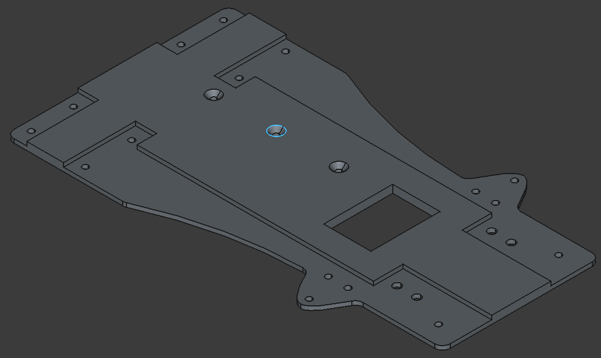
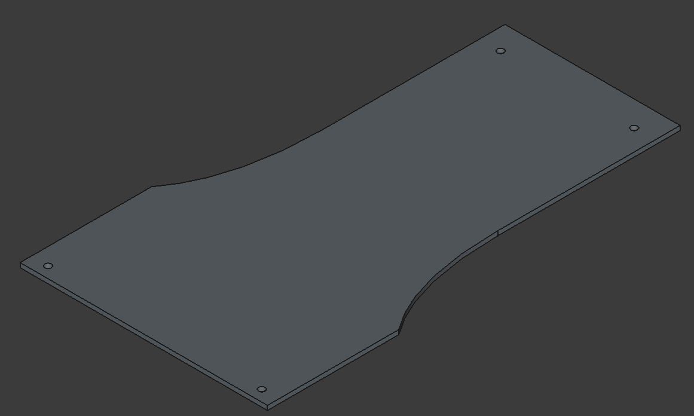
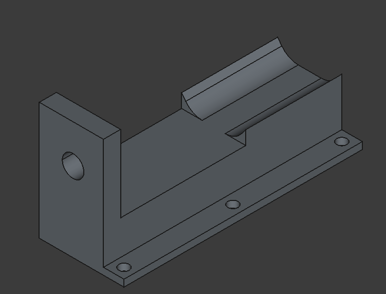
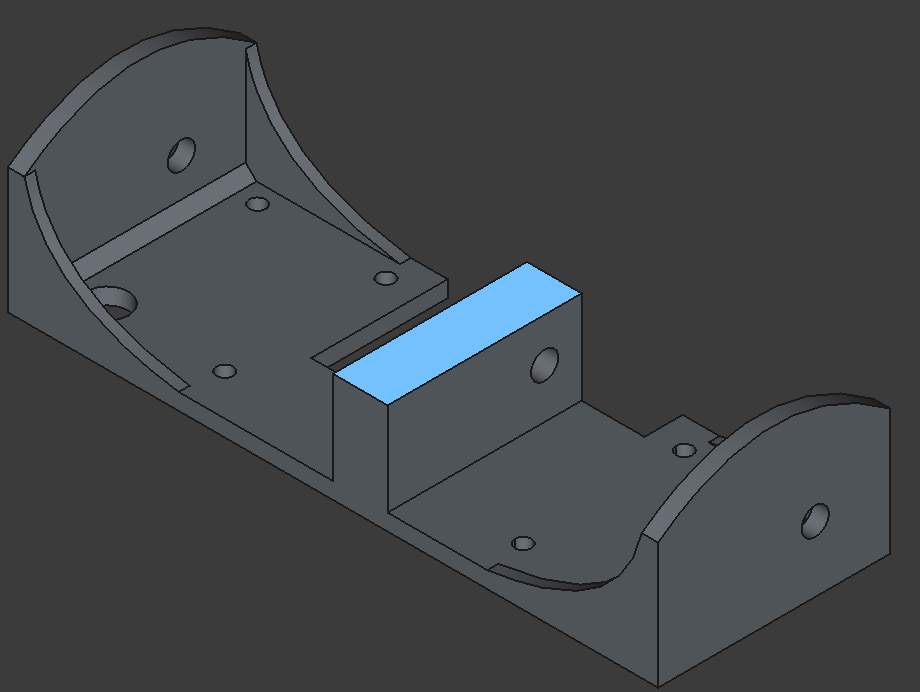
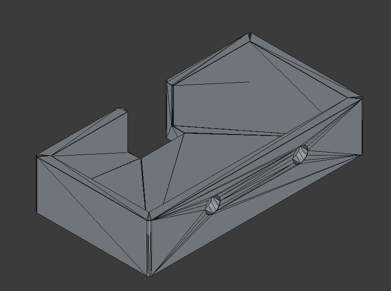
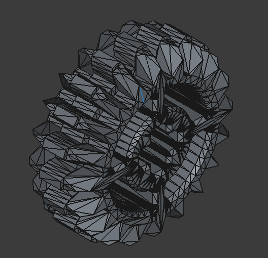
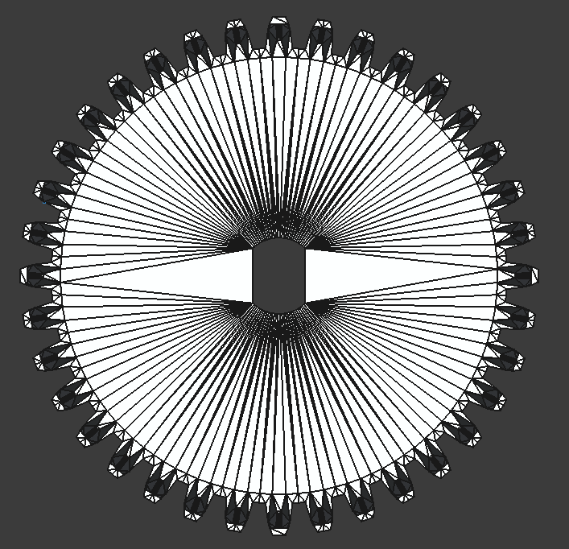

# Modelos 3D del robot

Este directorio contiene los diseños principales impresos en 3D del robot, incluyendo las estructuras base, los soportes de motor y eje, así como los soportes para los sensores ultrasónicos.

## 1. Placa inferior
La placa inferior es la estructura base del robot. Presenta huecos para los tornillos del servo, los soportes, el soporte del motor y el soporte del eje. En su parte inferior cuenta con una extrusión que cubre la mayor parte de la placa, lo que le proporciona mayor grosor y estabilidad en las zonas donde más se necesita.

## 2. Placa superior
La placa superior se conecta con la placa inferior mediante soportes, formando la estructura principal del chasis y permitiendo una distribución ordenada de los componentes del robot.

## 3. Soporte del motor
El soporte del motor se atornilla directamente sobre los huecos diseñados en la placa inferior. Su función es mantener el motor en la posición óptima para un funcionamiento estable y eficiente.

## 4. Soporte del eje
El soporte del eje sostiene el eje de manera que el engrane del eje y el engrane del motor giren de forma sincronizada. Está diseñado con soportes y bisagras para mejorar su resistencia y estabilidad.

## 5. Soporte HC-SR04
Los soportes para los sensores HC-SR04 fueron obtenidos a partir del modelo de Printables: https://www.printables.com/model/657026-hc-sr04-ultrasonic-sensor-holder-for-orp. Estos soportes se colocan en la parte frontal del robot para sostener los sensores de forma segura y estable.

## Engranes utilizados
Los engranes utilizados en el sistema de transmisión son de 36 dientes y 28 dientes de LEGO.

## Modificación del engrane de 36 dientes
El engrane de 36 dientes fue modificado para volverse sólido por dentro y adaptarse al motor, lo que mejora su compatibilidad y resistencia dentro del sistema mecánico.

